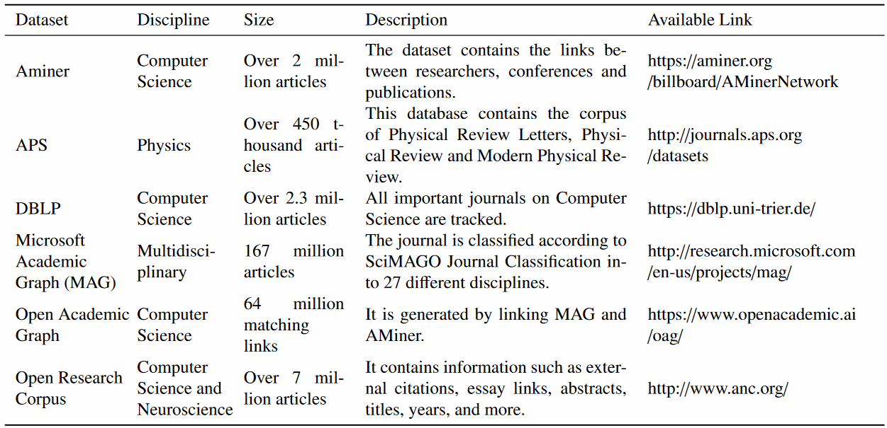

## 数据源

#### 学术数据

|                             | Question 1A | Question 2A                   |
| --------------------------- | ----------- | ----------------------------- |
| 学者网络数据                | 有用        | **必要**（学者/文章必有其一） |
| 文章网络数据 & 人-文关联    | **必要**    | **必要**（学者/文章必有其一） |
| 文章摘要/全文/关键词        | 很有用      | 有点用                        |
| 学者元数据（引用量 机构等） | 有点用      | **必要**                      |
| 多学科数据 & 有学科划分     | **必要**    | 有用                          |
| 长时间尺度的数据            | **必要**    | 很有用                        |

突出候选：

- **OpenAlex** (Best candidate for online use)
  - Wrapper: OpenAlexR / diophila / OpenAlexAPI

- **MAG** (Best candidate for large-volume offline use)
- **DOAJ** (Best candidate for smaller-volume offline use)
- **Crossref** **SemanticsScholar** **Aminer** 

全部候选：

|                                                              | 学者网络 | 文章网络 & 人-文关联 | 摘要/ 全文/ 关键词 | 学者元数据 | 多学科 & 学科划分  | 长时间尺度 | 可在线查询 | 可下载        | 获取门槛      |
| ------------------------------------------------------------ | -------- | -------------------- | ------------------ | ---------- | ------------------ | ---------- | ---------- | ------------- | ------------- |
| **[MAG](https://zenodo.org/record/6511057)**                 | N?       | Y                    |                    | Y?         | Y (Good)           | Y          | N?         | Y             | N             |
| **OpenAlex**                                                 | N        | Y                    | Y? (abs)           | Y          | Y (Good)           | Y          | Y          | Sortof (Huge) | N             |
| **[Sem](https://www.semanticscholar.org/product/api) [Schlr](https://github.com/allenai/s2orc)** |          | Y                    | Y  (~all)          | Y          | Y?                 | Y?         | Y          |               | Y     (申请?) |
| **Cross ref\***                                              |          | Y?                   |                    |            | Sortof (messy\*\*) | Y          | Y          |               | N?            |
| **DOAJ**                                                     | N        | Y?                   | Y? (abs)           |            | Y (Good)           | Y?         | Y          | Y             | N             |
| **[A](https://www.aminer.cn/aminernetwork) mi[n](https://www.aminer.cn/data/)e[r](https://cloud.tencent.com/developer/article/1827070)** | Y?       | Y?                   |                    | Y?         | N? (CS?)           |            |            | Y             | N?            |
| OAG                                                          |          | Y?                   |                    |            | N?  (CS?)          |            |            |               |               |
| Sco pus\*                                                    | N?       |                      |                    |            |                    |            | Y          |               |               |
| Dimensions\*                                                 |          |                      |                    |            |                    |            |            |               | Y     (申请)  |
| CWTS WoS\*                                                   |          |                      |                    |            |                    |            |            |               |               |
| ORC?                                                         |          |                      | Y? (~all?)         |            | N?  (CS & Neur?)   |            |            |               |               |
| Base-search                                                  |          |                      |                    |            | Y   (Good)         |            |            |               | Y     (申请)  |
| Constellate                                                  | N        | N                    | Y (~all?)          | N          | Y? (Good)          | Y?         | Sortof     | Y             | N             |
| [APS](https://ieeexplore.ieee.org/stamp/stamp.jsp?arnumber=8081732) | N?       |                      | Y?                 | N?         | N (Phys)           |            |            |               |               |
| [Biopy + PM](https://towardsdatascience.com/network-analysis-to-quickly-get-insight-into-an-academic-field-with-python-cd891717d547) |          |                      |                    |            | N  (Bio)           |            | Y          |               | N             |
| DBLP                                                         |          |                      |                    |            | N   (CS)           |            |            |               |               |

*: cf. Comparison of scientific documents from the period 2008–2017 covered by Scopus, CWTS Web of Science, Dimensions, Crossref, and Microsoft Academic. Credit: Martijn Visser, Nees Jan van Eck and Ludo Waltman Quantitative Science Studies 2021; 2 (1): 20–41.

\*\*: 学科划分 hard to use, and not sure if it obeys LCC

\*\*\*: 学科划分 easier to use, and obeys LCC



(image above is from Table 2 of the paper https://doi.org/10.1016/j.jnca.2019.01.029)

#### 社交媒体数据

- 大量工具：https://www.methodspace.com/blog/social-media-data-in-research-a-review-of-the-current-landscape 
- 清博大数据

#### 其他数据

详见本地的 `journal.md` (未上传 github )

## 文献调研

#### General remarks

- 应从以下列出的文章中选出最相关的少量文章，并用 connectedpapers 查询。
- 你可能的 JEL ：D71 / D79 / D91 / Y80 / Z19 ，但都不是 perfect fit 。后续搜索中不以 JEL 为标准。
- 文献发展的脉络/发展历程是什么？你的研究在文献中占什么位置（包括方法贡献）？
- 从文章的综述部分（以及综述文章）中学习和寻找其他文献。

#### Q1A, Cluster 0: 群体中多样性/同质性等的衡量方式

搜索内容：

- academic opinion 
  diversity OR polarization OR homogeneity OR heterogeneity OR fractionalization OR Gini-index

#### Q1A, Cluster 1: 预印本平台+观点多样性/同质性 [done]

搜索内容：

- diversity OR polarization OR homogeneity OR heterogeneity OR fractionalization OR Gini-index "preprint platforms" (completed first page 1-3)
- ... "preprint repositories" (completed page 1)
- ... "preprint servers" (completed page 1)
- ... "preprint services" (completed page 1)

结果：

- https://asistdl.onlinelibrary.wiley.com/doi/full/10.1002/pra2.660 [done]
- https://www.cjstp.cn/EN/10.11946/cjstp.202210110771 [discarded]
- https://journals.sagepub.com/doi/abs/10.1177/09610006211058908 (cross-platform comparison; comprehensive) [done]
- https://osf.io/preprints/metaarxiv/796tu/ (comprehensive) [done]
- https://www.mdpi.com/2304-6775/7/1/6 [done]
- https://journals.plos.org/plosbiology/article%3Fid%3D10.1371/journal.pbio.3000959?revisionLink=/plosbiology/article%3Fid%3D10.1371/journal.pbio.3000959%26rev%3D1 (important) [discarded]
- https://arxiv.org/abs/2102.09066 (growth of preprint platforms etc.) [done]
- https://www.mdpi.com/2304-6775/7/2/44 (growth of preprint platforms etc.)
- https://royalsocietypublishing.org/doi/abs/10.1098/rsos.201520 (survey on credibility of preprints) **[backup]**
- https://ww.ijicc.net/images/vol9iss4/9405_Hyun_2019_E_R.pdf (a diagram on biggest biomedical preprint services) [discarded]

Additional:
- https://www.ncbi.nlm.nih.gov/pmc/articles/PMC6914335/ [done]
- https://arxiv.org/ftp/arxiv/papers/2011/2011.11940.pdf [done]
- https://link.springer.com/article/10.1007/s11192-007-1661-8 [explanation relevant!] [done]
- https://link.springer.com/article/10.1007/s11192-009-0111-1 [explanation relevant!] [done]
- https://asistdl.onlinelibrary.wiley.com/doi/10.1002/asi.23044 (class 1) [done]
- https://onlinelibrary.wiley.com/doi/10.1002/asi.20663 [done]
- https://journals.plos.org/plosone/article?id=10.1371/journal.pone.0274441#references [done]
- https://journals.plos.org/plosgenetics/article?id=10.1371/journal.pgen.1008565 (class 2, backup)
- https://jamanetwork.com/journals/jama/fullarticle/2670247 (class 1) [done]
- https://direct.mit.edu/qss/article/1/2/618/96153/The-relationship-between-bioRxiv-preprints (class 1, controlled for variables) [done]
- https://journals.plos.org/plosmedicine/article?id=10.1371/journal.pmed.1002549 (outbreak) [done]
- https://link.springer.com/article/10.1007/s11207-006-0262-7 (class 1, equivalent to controlled?) [done]
- https://www.semanticscholar.org/paper/The-potential-of-preprints-to-accelerate-scholarly-Aman/a2c0188f221715501a7d7e4753835f143de9aca7 (class 1 ) [done]
- https://link.springer.com/article/10.1007/s11192-020-03612-4 (class 1)
- https://arxiv.org/abs/2102.09066 (class 1)

#### Q1A, Cluster 2: 预印本相关、定量方法论可借鉴的文章

搜索内容：

- allintitle: "preprint platforms" OR "preprint repositories" OR "preprint servers" OR "preprint services"

结果：

- https://www.sciencedirect.com/science/article/pii/S0169534721003062
- https://journals.plos.org/plosbiology/article%3Fid%3D10.1371/journal.pbio.3000959?revisionLink=/plosbiology/article%3Fid%3D10.1371/journal.pbio.3000959%26rev%3D1 (important)

#### Cluster ...

## Scheme 1Ax ：预印本平台的出现对引用量集中程度的影响

#### 模型细节

###### 回归方程

$Y_{dt} = \alpha_d+\beta_t+\gamma P_{dt}+\sum_{ATTR} \delta^{[ATTR]}C_{dt}^{[ATTR]}+\epsilon_{dt}$  

- $d,t$ ：学科和年份
- $Y_{dt}$ ：引用量集中度指标
- $\alpha_d,\beta_t$ ：固定效应
- $P_{dt}$ ：预印本平台普及度
- $C^{[*]}_{dt}$ ：与 $P_{dt}$ 相关的若干个需要控制的变量

对于 $\alpha_d,\beta_t$ 的处理，LSDV 和 FD 都分别使用，并对比结果。

- 或者 $\beta_t$ 用虚拟变量 (LSDV) ，$\alpha_d$ 分别尝试 LSDV 和 FD ？

关于模型性质：

- 异方差：由于样本量可能存在的差异，和学科/时期本身的不同，很可能有异方差。
- 序列相关：由于可能的遗漏变量/蛛网现象/持续不止一期的扰动等，导致很可能存在时间维度上的序列相关。由于不同学科同受扰动，导致很可能存在学科维度上的序列相关。若采用基于游走的抽样方式，则可能进一步带来所有维度上的序列相关。

###### 变量定义详述：引用量集中度指标 $Y_{dt}$ 

若干方案：

- （reference: CS 的引用量分布近似于 $\alpha=1.71$ 的 Pareto ）
- 引用量分布的偏度（否决，Pareto 在 $\alpha\leq 3$ 时偏度无定义）
- 引用量分布的 $\newcommand{\E}{\mathrm{E}}\newcommand{\Med}{\mathrm{Med}}\E[X]/\Med[X]$ （否决， $\alpha\leq 2$ 时方差无穷）
  - 对 Pareto ，$\E[X]$ 在 $\alpha\leq 1$ 时为 $+\infty$ 。
  - 对 Pareto ，$\Var[X]$ 在 $\alpha\leq 2$ 时为 $+\infty$ 。
- 引用量分布的 $\E[\log X]/\Med[\log X]$ （暂定采用）
  - 对 Pareto ，该指标 $= \frac{0.65}\alpha$
  - 对 Pareto ，$\log X$ 服从指数分布，$\newcommand{\Var}{\mathrm{Var}}\Var[\log X]=\alpha^{-2}$ 
  - 对 log-normal ，该指标等于零。
    - 因此，该指标可看成以 log-normal 为零点的数轴。如果实践中发现数值为负，考虑更换指标。
  - 为处理 $X=0$ 的情况，改为 $\log (X+1)$
- 引用量分布的 $\Med[\log X]-\mathrm{Q}_{0.01}[\log X]$ （备用方案）
  - $Q_{0.01}$ 表示 $0.01$ 分位数。$0.01$ 也可以换成十/千/万分之一等等。

- $q\in [0,1]$ 使得引用量最高的 $q\times 100\%$ 文章，占据了 $30\%/50\%/70\%/90\%$ 的总引用（备用方案）

变量的 scale ：

- 因为 $Y_{dt}$ 波动范围较小，故没有采用 log scale 或 reciprocal scale 的迫切必要，也不把回归方程的 RHS 用乘法连接。

###### 变量定义详述：预印本平台普及度 $P_{dt}$

即该学科所有期刊/会议发表的文章中，用有 preprint repository 版本的文章比例。

变量的 scale ：

- 采用原始比例值。

- 如果发现原始比例都小得可怜，考虑 zoom in on "core" publications ，而不优先考虑更换 scale （因为对这一比例用 log scale 缺少实际意义）。

###### 变量定义详述：与 $P_{dt}$ 相关的需控制的变量 $C^{[*]}_{dt}$

注：$\delta$ 其实最好关于学科 $d$ 有变截距，即 $\delta_d^{[ATTR]}$ 。但在样本量不够的情况下，暂且去掉下标 $d$ 来省变元数，并把这个作为一项 major limitation 。

- 当前有 19 + 8 - 1 + 1 + 10 = 37 个变元，有 19 * 40 = 760 个样本。若回归发现显著，尝试加入 $C$ 的变截距。

变量列表：

- $C_{dt}^{[Size,Size']}$ ：当年该领域的规模，及其滞后项（即去年）
- $C_{dt}^{[RelSize,RelSize']}$ ：当年该领域以及相关领域的总规模，及其滞后项（即去年）
- **以上两项的加入理由**：越大的领域，越值得投入成本建设平台
- $C_{dt}^{[CiteLag,CiteLag']}$ ：近期该领域的自引时间差，及其滞后项
  - 考虑自引而非所有引用，消去了来自预印本平台普及度的因果影响，即二者间只剩下单向的因果关系。
    - 如果采用所有引用的引用时间差，一种思路是 “把引用时间差对 $P$ 回归，然后用残差项来参与这里的回归” 。但分析发现这种做法是错误的。具体分析详见 TDL Task 180 。
  - 虽然 OpenAlex 数据全面性等种种问题，导致依然可能收到来自预印本平台普及度 $P$ 的因果影响，但只要它与 $P$ 的相关性没有高到近乎完美，应该就不会影响 OLS 的结果。
    - 我们真正关心的是 “文章从写完到有人想读的时间差” ，而 “自引时间差” 是其代理变量。代理变量误差只需与 $P$ 无关即可，但因为上一条的原因，*可能*会有弱相关性。这可能是一条 limitation 。
  - 对一篇文章，是用平均时间差还是最短时间差？（前者信息量更大，但更受发表年份影响）
- $C_{dt}^{[\#Paper,\#Paper']}$ ：近期该领域的人均文章数，及其滞后项
  - 随机 20 个发文起止时间都至少隔 10yr 的该领域学者（要求该领域为其第一顺位），算一下近年的发文数量（不限于本学科），然后 +1 后取对数再取平均。
- $C_{dt}^{[\#Author,\#Author']}$ ：近期该领域的篇均作者数，及其滞后项
- **以上三项的加入理由**：
  - 因素 1 ：“代际时差” ，时差越小，对 $P$ 越有正向的因果影响。（印证正向影响的[文章 1](https://physicstoday.scitation.org/do/10.1063/PT.6.4.20211108a/full/) ，[文章 2](https://www.nature.com/articles/s42254-021-00360-z) ）
    - 反面影响：若代际时差大，则更有动机避免工作重合，进而更有动机推广 preprint repository 。但我猜测其影响大小不如上面两篇文章所代表的正面影响。
  - 因素 2 ：“引用时差” ，时差越小，对 $P$ 越有正向的因果影响。
  - $C^{CiteLag}$ 同时反映 1,2 ；$C^{\#Paper,\#Author}$ 联合起来反映 3 。
  - $C^{\#Author}$ 也有独立的意义：越是单打独斗的领域，越需要交流渠道。
- 滞后项如何定义？过去五年（不含当年）的平均值？

变量的 scale ：八个变量都使用 log scale 。

#### 数据收集和处理

暂定采用 OpenAlexR （**记得引用 OpenAlex 和 OpenAlexR 的文章**）。

###### 数据范围和指标 $d,t$ 定义

$d$ 的范围：OpenAlex 上全部 19 个 level-0 concept

- 之后考虑加入 level-1/2/... concept
  - 但对于细分学科，在 $C^{Size,Size'}$ 和 $C^{RelSize,RelSize'}$ 这两对变量上，我们还是需要其所在的最高级学科的规模；因为很少有服务于单个子学科的 preprint repository 。但子学科的数据是否可以作为代理变量？
    - 对于另外三对 $C$ 变量，采用子学科数据和最高级学科数据都有一定道理，但后者可能更有道理一点。最有道理的是给两个都设立变量。

$t$ 的范围：1979 (~1e6 papers yearly) - 2018 (~1e7 papers yearly) ，每年作为一个时段

###### 采样模式 1 ：对文章采样

采用此模式的项目：

- 引用数分布的对数期望和中位数
- repository 比例
- 领域规模 $C^{Size,Size'}$
  - 至于 $C^{RelSize,RelSize'}$ ，直接看 concept 对应的文章数即可，不按相关度加权，故也无需抽样。

抽样组别的差异维度：

- 学科
- 年份
- general (所有文章) / repos (在 preprint repository 中的文章)

所抽样文章的必备特征：

- journal-article / proceedings-article
  - （可选）且拥有至少一个并非 preprint repository 的 journal 类型 venue（为了筛出 SSRN 等的影响）
- 以 concept 相关度的平方作为权重

**抽样方案 1 ： Metropolis-Hastings 及其变种**

- 第零步：规定目标分布和转移图

  - 转移图：有向图，包含引用边和被引边两种。
    - 每个点的所有引用边需要等权、所有被引边需要等权。在此前提下具体的权重分配可以灵活。
      - 设计权重分配规则，以减小相关性、降低热身用时。
  - 目标分布：采用两阶段方法，用一阶段的抽样结果确定二阶段的目标分布。
    - 一阶段：所有文章等概率分布。
    - 二阶段：对一篇文章 $i$ ，设其相关度*平方*构成的向量为 $\mathbf{r}_i\in\R^{19}$ ，则其权重 $w_i$ 正比于 $\mathbf{r}_i\cdot\mathbf{w}$ ，其中 $\mathbf{w}$ 是某个权重向量。
      - $\mathbf{w}$ 的选取方式：尽可能使得一阶段抽样结果的 $\sum_{i} w_i\mathbf{r}_i$ 向量在各维度上平均。（即 $\mathrm{normalize}(\mathbf{R^T Rw})\approx (1,\cdots,1)^T$ ，其中 $\mathbf{Rw}$ 即等于向量 $(w_i)$ ）
        - （第五步中解决方案 2 所需的改动）把 $\mathbf{R^T Rw}$ 改成 $\mathbf{M^T Rw}$ ，其中 $\mathbf{M}$ 中每一行是文章 $i$ 的所有邻居（和自身）的相关度平方向量之和。
      - 但还要保证权重都非负且不出现不合理情形；所以不能简单地解方程。

- 第二步：一阶段抽样

  - 用 random API 选择 MH 起点

- 第三步：计算二阶段分布

- 第四步：二阶段抽样

  - 用 random API 选择 MH 起点
  - 全体邻居的度数可以通过一次查询得到
    - 注意到，要想使用这一性质，就必须保证你的 MCMC 是在邻居中等概率抽样（但目标分布不必等概率），除了可以区别对待引用和被引。
  - possibly 分为多次 MCMC 分别进行，因为全图不一定连通
    - reference: CS GCC size 88% (second largest 0.04%), 2018年医学(口腔医学?) GCC Size 63%
    - 实现一个连通性判断？
      - heuristics guided search/random walk? 试着像DSU一样收敛到同一个点?
      - 同步推进多个MCMC过程?（这样可以避免不知道MCMC链要多少条、进而不知道要多长的问题）
      - 或者只需试探一下GCC的大小? 随机取若干个点, 试图让它们聚拢, 看有多少个能聚拢到一起
        - 把成功率和已知连通的情况进行对比；方法是用MH生成GCC中的多对可达点对，然后看多大比例无法聚拢

- 第五步：取 MC 过程中经过的所有点的**所有邻居**（以 concepts 系数的平方为权重，同时放入多个学科）

  - 效率: O(链长)次询问，得到链点的所有邻居的profile（出入度、concepts）
    - 并决定前两步如何实现

  - 一些细节 
    - 邻居的分布与目标分布不同？
      - 解决方案1：要想考察所有邻居，只需假想再做一步MCMC即可。（等价于在邻居中进行重抽样）
      - 解决方案2：改权重向量 $\mathbf{w}$ 的定义，使其把所有采样点的所有邻居的总和均衡化，而非把所有采样点均衡化。（这会直接改变样本组成，而不是重抽样）
      - 解决方案 2 的采样效率高于解决方案 1 ，实现应该也更简洁。优先采用方案 2 。
    - “所有邻居” 中需要包括自己和邻居！  (并需要相应地调整重采样公式)
      - 只有邻居的话，可能会忽视 citation=0 的文章

**抽样方案 2 ：按concept hierarchy抽样**

- 把数量降到20000以内，然后用paging来抽样? -> 但是方差很大
- 不同年份混采? 通过调整区间来均衡样本量
- *基于concept+年份+学科的抽样?* (可以groupby concept来决定按哪个concept来搜寻)

**抽样方案 3 ：缩小学科范围**

- 不采用 level-0 concepts 而是采用更低级概念，从而降低概念对应的文章数
- 一个问题：理论上，对于 $C^{Size,Size'}$ ，我们还是需要其所在的最高级学科的规模

**抽样方案 4 ：基于模式 2 的抽样结果**

- 对于模式 2 中考虑的所有作者（中的另一些随机样本），在其所有工作中进行重抽样。

（废弃）~~抽样方案 5 ：按日期抽样~~

- ~~按日期降序排序, 取第一页 (仅一次查询)~~
  - ~~一个重大问题：这会偏好特定的期刊之类（刚巧在那一天发布的刊物）~~
  - ~~一个重大问题：同一日期的文章太多 (1e3-3e4), 互相之间可能并非随机顺序~~

###### 采样模式 2 ：对作者采样

采用此模式的项目：

- 人均文章数
- 篇均作者数
- 自引时间差

抽样组别的差异维度：

- 学科

所抽样学者的必备特征：

- 作品数不能太少
- 作品的时间范围最好不太短（千分位数作者的平均时间范围约为 25yr ，高不确定性）
- 作品最好是完整收录，没有或少有缺失

**抽样方案 1 ：在全体高产作者中本地抽样** 

- 对每个领域，把范围定到 <=2w 人，然后全都扒下来（1900次查询，绰绰有余）
- 第一步：对每个学科，划定 works_count 阈值，并算出所有学科的最低阈值 $thres$ 
  - 划定标准，是包含该 concept 的所有学者中 works_count 的千分之一分位数。
  - 对 concept 的相关度不作要求；因为是时序比较而非跨学科比较，所以学科间不对等也关系不太大，而且想修正这一不对等性，后面的方案 2 也做得到。
  - 对文章最多的 CS 和最少的 His ，这一阈值分别约为 250, 170 ；阈值上的人数分别约为 8w, 2w 。
- 第二步：得到 works_count 达到 $thres$ 的所有学者的初步信息
  - 利用 cursor paging 。不分学科。
  - 对于总文章数达到 5000 的人，用一次询问获得其仅包含 journal/proceedings article 的作品数，并依据此决定其去留。
- 第三步：把学者按第一顺位学科归类
  - 方案 1 ：对每个学科，保留所有达到 $thres$ 的第一顺位学者，即使没有达到该学科本来的阈值
  - 方案 2 ：对每个学科，保留所有达到其本来阈值的第一顺位学者
    - 对保留的每个人，计算遍历其作品所需的页数，并对全局取平均（记作 $\overline p$ ）
  - 推荐采用方案 2 （因为第三步的样本量不是瓶颈，第四步的才是），如果人数不够再用 1 。
- 第四步：对每个学科，在本地从第三步的学者集合中抽样
  - 每个学科给予相同的学者样本配额：$\frac{10000}{19\overline p}$ 
  - 对每个单独的学者，其文章列表 / 自引数，可以分别用一次查询完成。
    - 对作者数特别多的文章，可能要对其单独询问作者数。或者改为计算作者数的中位数而非均值。

（废弃）~~抽样方案 2 ：基于随机游走的抽样，或基于模式 1 抽样结果的抽样~~

- ~~在模式 1 的过程中考察全体作者，然后进行重采样（一个好处是可以保证发表年份覆盖范围广）~~

（废弃）~~抽样方案 3 ：基于作品数筛选 + 姓名字典序排列~~

- ~~按字典序的作者采样，意味着一些非英文作者 will have zero representation~~

###### 数据收集和处理：引用量集中度指标 $Y_{dt}$ 

基于采样模式 1 的结果，直接计算 $\E[\log X],\Med[\log X]=\log\Med[X]$ 即可。（两个备用指标同理）


###### 数据收集和处理：预印本平台普及度 $P_{dt}$

思路：计算 OpenAlex 中各学科 preprint 的比例

- 利用 `filter=repository:V...|V...|...` 来筛选
- OpenAlex 会把 preprint 和 journal article 合并
- 一些 repository 分为多个 venue （如 HAL ），一些 repository 的 type 并非 repository （如 SSRN ）

| 平台名称     | 文章数量 | 学科                 | Venue ID |
| ------------ | -------- | -------------------- | -------- |
| RePEc        | 3e6      | econ                 |          |
| ArXiv        | 2e6      | math, phys, CS, etc. |          |
| ScienceOpen? | 2e6?     | multi                |          |
| SSRN         | 1e6      | multi                |          |
| Zenodo       | 1e6      | multi                |          |
| HAL          | 1e6      | multi                |          |
| bioRxiv      | 1e5      | bio                  |          |
| PhilArchive  | 7e4      | phil                 |          |
| E-LIS        | 2e4      | information science  |          |
| PsyArXiv     | 1e4      | psychology           |          |

###### 数据收集和处理：与 $P_{dt}$ 相关的需控制的变量 $C^{[*]}_{dt}$

- 相关领域总规模
  - 用两个 filter ，一个要求包含此 concept ，另一个限定年份；然后直接取原始 count 。
- 领域规模
  - 在相关领域总规模的基础上，乘以采样模式 1 的样本均方相关度。
- 人均文章数、篇均作者数、自引时间差
  - 详见代码框架。

#### 代码框架

- 获取学科列表，即全部 19 个 level-0 concept

- 预先准备好回归数据 dataframe ，确定好维度
  - 时间划分: 1979-2018，每年一个时段
  - 行数 19 * 40 = 760
  - 列：(discip, period, nsamp_paper, ex_log, log_med, repo_ratio, log_field_sz, log_relevant_field_sz, n_top_author_d, nsamp_author_d, nsamp_author_dt, log_self_cite_lag, log_papers_per_author, log_authors_per_paper, log_top_1_in_10, log_top_1_in_100, log_top_1_in_1k, log_top_1_in_10k, 30pc_dominator, 50pc_dominator, 70pc_dominator, 90pc_dominator)

- 预先准备好文章采样 dataframe 二维列表

  - 二维列表维度：19 * 40 ，每个格子里是一个 dataframe
  - dataframe 的列：relevance^2, cited_by_count, in_repository, n_author
    - （初始没有行也没有列）

- **对学者抽样**，并备份抽样结果

  - 记录 n_top_author_d, nsamp_author_d 等等列

- 枚举学科，然后：

  - 定义四个数组：人数、文章数、文章的总作者数、文章的首次自引总时差

    - 前三个 1960-2021 ，最后一个 1960-2018

  - 枚举学科对应的学者样本，然后：

    - （可选）如果学者的总文章数过多，则对人均文章数/篇均作者数都用一次 `group_by` 计算，仅对随机的一部分样本获取完整文章列表并计算自引时间差。
    - 定义变量，记录最早文章年份 min 和最晚文章年份 max
    - 若此人的文章数大于 1000 ：
      - 进行一次 group_by=publication_year ，若第一项的年份贡献了 >= 50% 的发表，则跳过此人、此人不加入四个数组，并把 Author ID 记录在全局表中。

    - 加入 nsamp_author_d

    - cursor 查询到其所有的文章（**要求符合采样模式 1 的要求 1** ），按 publication_date 升序排列
      - （在第一次查询中，若发现真实的 count < thres 则跳过）
      - 如果发现加上要求 1 后的总数 $<\frac 12 thres$ 则抛弃，从 nsamp_d 中减掉、此人不加入四个数组，并把 Author ID 记录在全局表中。
      - 维护一个 env ，从 work ID 映射到日期
      - 读取：年份、作者数、引用列表
        - 对于 truncated 的文章，单独一次查询获得其真实作者数。

      - 更新此人文章数、此人文章的总作者数
      - 遍历引用列表，若在 env 中且日期严格早于本文，则：
        - 计算时差（精确到天），对 1096 天取 min ，并把它加入所引文章的年份的自引总时差数组
        - 然后删除之
      - 把本文加入 env
      - 把本文加入文章 dataframe 矩阵中的对应位置
    - 把 env 中所有剩余的文章，按照 1096 天计，加入总时差数组。
    - 给 [min,max] 对应的人数数组 += 1
      - 之所以这么加（而不对头尾做特殊处理），是仔细思考后认为在此种情况下最合理的方式。

  - 从四个数组，通过直接相除…… 

    - （若分母上人数为零或文章数为零，则设为 NA ，并增加分别计数人数/文章数为零的两个计数器）
    - 计算人均文章数（log）
    - 计算篇均作者数（log）
    - 计算自引时间差（log）
    - 以及写入 nsamp_paper 等等其他项目

- 保存全部数据

- 看一下全局表是否非空，如果是则检查是否应将其加回

- 得到上述数据后看一下是否样本量过小（包括但不限于为零）或者出现异常变化趋势，若有则考虑滑动平均。

- 保存全部数据

- 枚举学科、枚举时段，然后:

  - 计算 RelSize（log）
  - **对文章抽样**（possibly based on 学者列表），并备份抽样结果
    - 方法：直接用文章 dataframe 矩阵中对应格子里的数据
  - 计算领域规模（log）
    - 计算样本中的均方相关度，乘以 metadata 中的文章总数
      - 若基于 Author 抽样，则应将**平方和**乘以 n_top_author_d÷nsamp_author_d
  - 计算引用数分布的对数期望和对数中位数（log）
  - 计算 repository 比例（original）
  - **计算出的量填进 dataframe 的对应位置**，并备份 dataframe
    - （ 除了 repository ratio 以外都有对数操作）

- Dataframe 转成 pdata.frame
  - 并加入滞后项（过去五年取平均？）

- 回归
  - Y ~ [see formula above]
    - 所有项都采用单一变元，没有变斜率
    - 但还需加上时间维度的和学科维度的固定效应，到时看着办
  - 回归方案 1 ：OLS + 稳健标准误（处理异方差，忽略序列相关）
  - 回归方案 2 ：可行 WLS（处理异方差和序列相关）
  - 两个方案都做一下，但先实现方案 1 。

- 保存备份

#### 代码实现

###### Header

```R
options(repos=structure(c(CRAN="https://mirrors.tuna.tsinghua.edu.cn/CRAN/")))
Sys.setenv(LANG = "en_US.UTF-8")
library(openalexR)
library(dplyr)
library(stringr)
library(data.table)
library(reticulate)
library(matrixStats)
library(Hmisc)
library(plm)

library(haven)
library(plyr)
library(sandwich)
library(stargazer)
library(fixest)
library(data.table)
library(lmtest)
library(car)

use_condaenv("C:/Users/22343/anaconda3")
py_config()
py_available()
py_module_available("pandas")

options(openalexR.mailto = "gordanqiu@outlook.com")
```

###### Get discipline list

```R
discips <- oa_fetch(
  entity = "concepts",
  level = 0
)
discips$id_nourl <- sapply(discips$id, function(s) str_replace_all(s, "https://openalex.org/", ""))

saveRDS(discips, "./backup/discips_incomplete.rds")
```

###### Prepare containers

`data.frame` for regression variables

```R
reg_data <- data.frame( # attributes without _dt suffix are by default varying across both the discip and the time dimension
  discip = rep(NA, 19*40), # 1-19, numeric, [done]
  time = rep(NA, 19*40), # 1979-2018, numeric, [done]
  nsamp_paper = rep(NA, 19*40), # [done]
  ex_log = rep(NA, 19*40), # E[log(citation)], 
  ex = rep(NA, 19*40), # E[citation] (if that's well-defined)
  log_med = rep(NA, 19*40), # log(Med[citation])
  med = rep(NA, 19*40), # Med[citation]
  repo_ratio = rep(NA, 19*40),
  log_field_sz = rep(NA, 19*40),
  log_rel_field_sz = rep(NA, 19*40),
  n_top_author_d = rep(NA, 19*40), # number of top authors for each discipline
  nsamp_author_d = rep(NA, 19*40), # sample size of top authors for each discipline
  nsamp_author_dt = rep(NA, 19*40), # number of top authors for each discipline in each time period
  self_cite_lag = rep(NA, 19*40), 
  log_self_cite_lag = rep(NA, 19*40), # average "first self citation" for papers published in each discipline during each time period
  log_papers_per_author = rep(NA, 19*40),
  log_authors_per_paper = rep(NA, 19*40),
  log_cite_top_1_in_10 = rep(NA, 19*40), # 10% percentile citation
  log_cite_top_1_in_100 = rep(NA, 19*40), # 1% percentile
  cite_30pc_dominator = rep(NA, 19*40), # top ?% papers receive 30% of all citation
  cite_50pc_dominator = rep(NA, 19*40), # top ?% papers receive 50% of all citation
  cite_70pc_dominator = rep(NA, 19*40), # top ?% papers receive 70% of all citation
  cite_90pc_dominator = rep(NA, 19*40), # top ?% papers receive 90% of all citation
  stringsAsFactors = FALSE
)
```

`[[data.frame]]` for sampled articles

```R
paper_samp_data <- list()

for(d in 1:19){
  paper_samp_data[[d]] <- list()
  for(t in 1979:2018){
    paper_samp_data[[d]][[t]] <- data.frame()
  }
}
```

###### Sampling authors (Mode 2)

compute `works_count` threshold for each discip

  - k = 10..0, try to add $2^k$ to the current threshold, test if it's too high

```R
for(d in 1:19){
  print(d)
  thres <- 1
  concept_id <- discips[d, "id_nourl"]
  
  get_count <- function (thr, c_id) {
    ppl_count <- as.numeric(oa_fetch(
      entity = "authors",
      x_concepts.id = c_id,
      works_count = paste(">", toString(thr-1), sep = ""),
      count_only = TRUE
    )[1])
    return(ppl_count)
  }

  all_ppl_count <- get_count(1, concept_id)

  for(k in 10:0){
    new_thres <- thres + (2^k)
    ppl_count <- get_count(new_thres, concept_id)
    if(ppl_count * 1000 >= all_ppl_count){
      thres <- new_thres
    }
  }

  discips[d, "thres_1in1k"] <- thres
}
```

find lowest threshold among all disciplines

```r
min_thres <- min(discips$thres_1in1k)
print(min_thres)
```

list all authors above corresponding thresholds, classified by first discipline, then perform sampling

```r
topauthors <- import("topauthors")

if(file.exists("./backup/authors_above_100.rds")){
  authors_above_100 <- readRDS("./backup/authors_above_100.rds")
}
else{
  authors_above_100_raw <- topauthors$get_top_authors(discips, min_thres)

  authors_above_100 <- authors_above_100_raw
  authors_above_100$works_cnt <- as.integer((authors_above_100$works_cnt) + 0.5)
  authors_above_100$discip <- as.integer((authors_above_100$discip) + 0.5)

  gc()
  summary(authors_above_100)
  saveRDS(authors_above_100,"./backup/authors_above_100.rds")
  saveRDS(authors_above_100_raw,"./backup/authors_above_100_raw.rds")
}

avg_pages_per_author = mean(as.integer((authors_above_100$works_cnt + 199) / 200))
quota_per_discip = as.integer(10000 / (19*avg_pages_per_author))
print(c(quota_per_discip, avg_pages_per_author))

set.seed(42)

author_samples <- list()

for(d in 1:19){
  thres_d <- as.numeric(discips[d, "thres_1in1k"])
  eligible <- authors_above_100[
    (authors_above_100$discip == d) &
    (authors_above_100$works_cnt >= thres_d),
  ]
  reg_data$n_top_author_d[((d-1)*40+1):(d*40)] = nrow(eligible)

  author_samples[[d]] <- eligible[sample(nrow(eligible), min(nrow(eligible), quota_per_discip)), ]
  rm(eligible)

  gc()
}

saveRDS(author_samples,"./backup/author_samples.rds")
```

###### Processing samples (Mode 2)

```R
outliers <- list()

processpapers <- import("processpapers")

for(d in 1:19){
  result_pack_filename <- paste("./backup/result_pack_", toString(d), ".rds", sep = "")
  if(file.exists(result_pack_filename)){
    result_pack <- readRDS(result_pack_filename)
  }
  else{
    result_pack <- processpapers$get_vecs_nsamp_paperdfs_v9(
      1960, 2018,
      1960, 2021,
      1979, 2018,
      as.numeric(discips[d, "thres_1in1k"]),
      toString(discips[d, "id_nourl"]),
      author_samples[[d]]
    )
    saveRDS(result_pack, paste("./backup/result_pack_", toString(d), ".rds", sep = ""))
  }
  
  n_ppl <- result_pack[[1]]  # 1960-2021
  n_papers <- result_pack[[2]]  # 1960-2021
  tot_authorship <- result_pack[[3]]  # 1960-2021
  tot_selfcitelag <- result_pack[[4]]  # 1960-2018
  
  rownum_start <- (d-1)*40 + 1
  rownum_range <- (rownum_start:(rownum_start + 39))
  reg_data$nsamp_author_d[rownum_range] = result_pack[[5]]
  
  r6_len <- as.integer(result_pack[[6]] + 0.5)
  if(r6_len != 40){
    print(paste('r6_len =', r6_len))
  }
  for(t in 1979:(1979 + r6_len - 1)){
    paper_samp_data[[d]][[t]] <- as.data.frame(read.csv(paste("./datatransfer/paper_df_", t-1979+1, ".csv", sep = "")))
  }
  saveRDS(paper_samp_data,"./backup/paper_samp_data.rds")
  
  outliers[[d]] <- result_pack[[7]]
  saveRDS(outliers,"./backup/outliers.rds")

  n_ppl_part = n_ppl[(1979-1960):(2018-1960)]
  n_papers_part = n_papers[(1979-1960):(2018-1960)]
  tot_authorship_part = tot_authorship[(1979-1960):(2018-1960)]
  tot_selfcitelag_part = tot_selfcitelag[(1979-1960):(2018-1960)]

  print(n_ppl_part)
  print(n_papers_part)
  
  setNA <- function (vec, name, d) {
    print(paste(name, "d:", d, "NA_count:", sum(is.infinite(vec) | is.nan(vec))))
    vec[is.infinite(vec) | is.nan(vec)] <- NA
    return(vec)
  }
  reg_data$log_papers_per_author[rownum_range] <- setNA(log((n_papers_part / n_ppl_part) + 1), "log_papers_per_author", d)
  reg_data$log_authors_per_paper[rownum_range] <- setNA(log(tot_authorship_part / n_papers_part), "log_authors_per_paper", d)
  reg_data$log_self_cite_lag[rownum_range] <- setNA(log((tot_selfcitelag_part / n_papers_part) + 1), "log_self_cite_lag", d)
  print(reg_data$log_self_cite_lag[rownum_range])
  reg_data$nsamp_paper[rownum_range] <- n_papers_part
  reg_data$nsamp_author_dt[rownum_range] <- n_ppl_part
  saveRDS(reg_data,"./backup/reg_data.rds")
}

reg_data$self_cite_lag = exp(reg_data$log_self_cite_lag) - 1
saveRDS(reg_data,"./backup/reg_data.rds")
```

###### Processing samples (Mode 1)

```R
for(d in 1:19){
  for(t in 1979:2018){
    rownum = (d-1)*40 + t - 1979 + 1
    reg_data$discip[rownum] <- d
    reg_data$time[rownum] <- t

    paper_samps <- paper_samp_data[[d]][[t]]
    if(sum(paper_samps$rel2) > 0){
      reg_data$ex_log[rownum] <- weighted.mean(log(paper_samps$cited_by_cnt + 1), paper_samps$rel2)
      reg_data$ex[rownum] <- weighted.mean(paper_samps$cited_by_cnt, paper_samps$rel2)
      reg_data$med[rownum] <- weightedMedian(paper_samps$cited_by_cnt, paper_samps$rel2)
      reg_data$log_med[rownum] <- log(reg_data$med[rownum] + 1)
      reg_data$repo_ratio[rownum] <- weighted.mean(paper_samps$in_repo, paper_samps$rel2)
      reg_data$log_field_sz[rownum] <- log(sum(paper_samps$rel2) * (reg_data[rownum, 'n_top_author_d'] / reg_data[rownum, 'nsamp_author_d']) + 1)
      reg_data$log_rel_field_sz[rownum] <- log(nrow(paper_samps) * (reg_data[rownum, 'n_top_author_d'] / reg_data[rownum, 'nsamp_author_d']) + 1)
      reg_data$log_cite_top_1_in_10[rownum] <- as.numeric(wtd.quantile(paper_samps$cited_by_cnt, weights = paper_samps$rel2, normwt = TRUE, probs = 0.9, type = 'i/(n+1)'))
      reg_data$log_cite_top_1_in_100[rownum] <- as.numeric(wtd.quantile(paper_samps$cited_by_cnt, weights = paper_samps$rel2, normwt = TRUE, probs = 0.99, type = 'i/(n+1)'))
      if(sum(paper_samps$cited_by_cnt * paper_samps$rel2) > 0){
        reg_data$cite_30pc_dominator[rownum] <- as.numeric(wtd.quantile(paper_samps$cited_by_cnt, weights = paper_samps$cited_by_cnt * paper_samps$rel2, normwt = TRUE, probs = 0.7, type = 'i/(n+1)'))
        reg_data$cite_30pc_dominator[rownum] <- weighted.mean(as.integer(paper_samps$cited_by_cnt >= reg_data$cite_30pc_dominator[rownum]), paper_samps$rel2)
        reg_data$cite_50pc_dominator[rownum] <- as.numeric(wtd.quantile(paper_samps$cited_by_cnt, weights = paper_samps$cited_by_cnt * paper_samps$rel2, normwt = TRUE, probs = 0.5, type = 'i/(n+1)'))
        reg_data$cite_50pc_dominator[rownum] <- weighted.mean(as.integer(paper_samps$cited_by_cnt >= reg_data$cite_50pc_dominator[rownum]), paper_samps$rel2)
        reg_data$cite_70pc_dominator[rownum] <- as.numeric(wtd.quantile(paper_samps$cited_by_cnt, weights = paper_samps$cited_by_cnt * paper_samps$rel2, normwt = TRUE, probs = 0.3, type = 'i/(n+1)'))
        reg_data$cite_70pc_dominator[rownum] <- weighted.mean(as.integer(paper_samps$cited_by_cnt >= reg_data$cite_70pc_dominator[rownum]), paper_samps$rel2)
        reg_data$cite_90pc_dominator[rownum] <- as.numeric(wtd.quantile(paper_samps$cited_by_cnt, weights = paper_samps$cited_by_cnt * paper_samps$rel2, normwt = TRUE, probs = 0.1, type = 'i/(n+1)'))
        reg_data$cite_90pc_dominator[rownum] <- weighted.mean(as.integer(paper_samps$cited_by_cnt >= reg_data$cite_90pc_dominator[rownum]), paper_samps$rel2)
      }
      else{
        print(paste("half-zero", d, t))
        reg_data$cite_30pc_dominator[rownum] <- NA
        reg_data$cite_50pc_dominator[rownum] <- NA
        reg_data$cite_70pc_dominator[rownum] <- NA
        reg_data$cite_90pc_dominator[rownum] <- NA
      }
    }
    else{
      print(paste("full-zero", d, t))
      reg_data$ex_log[rownum] <- NA
      reg_data$ex[rownum] <- NA
      reg_data$med[rownum] <- NA
      reg_data$log_med[rownum] <- NA
      reg_data$repo_ratio[rownum] <- NA
      reg_data$log_field_sz[rownum] <- NA
      reg_data$log_rel_field_sz[rownum] <- NA
      reg_data$log_cite_top_1_in_10[rownum] <- NA
      reg_data$log_cite_top_1_in_100[rownum] <- NA
      reg_data$cite_30pc_dominator[rownum] <- NA
      reg_data$cite_50pc_dominator[rownum] <- NA
      reg_data$cite_70pc_dominator[rownum] <- NA
      reg_data$cite_90pc_dominator[rownum] <- NA
    }
  }

  saveRDS(reg_data,"./backup/reg_data.rds")
}

reg_data$log_cite_top_1_in_10 <- log(reg_data$log_cite_top_1_in_10 + 1)
reg_data$log_cite_top_1_in_100 <- log(reg_data$log_cite_top_1_in_100 + 1)
saveRDS(reg_data,"./backup/reg_data.rds")
```

###### Regression

```r
reg_pdata <- pdata.frame(reg_data, index = c("discip", "time"))
saveRDS(reg_pdata,"./backup/reg_pdata.rds")
summary(reg_pdata)

# reg_pdata <- readRDS("./backup/reg_pdata.rds")
```

LSDV + HAC Robust SE

```r
lag_yrs = 2

reg_pdata_ext <- reg_pdata
reg_pdata_ext$repo_ratio_prev <- plm:::lagt.pseries(reg_pdata$repo_ratio, lag_yrs)
reg_pdata_ext$repo_ratio_avg <- (plm:::lagt.pseries(reg_pdata$repo_ratio, 1) + plm:::lagt.pseries(reg_pdata$repo_ratio, -1)) / 2
reg_pdata_ext$log_field_sz_prev <- plm:::lagt.pseries(reg_pdata$log_field_sz, lag_yrs)
reg_pdata_ext$log_rel_field_sz_prev <- plm:::lagt.pseries(reg_pdata$log_rel_field_sz, lag_yrs)
reg_pdata_ext$log_self_cite_lag_prev <- plm:::lagt.pseries(reg_pdata$log_self_cite_lag, lag_yrs)
reg_pdata_ext$self_cite_lag_prev <- plm:::lagt.pseries(reg_pdata$self_cite_lag, lag_yrs)
reg_pdata_ext$log_papers_per_author_prev <- plm:::lagt.pseries(reg_pdata$log_papers_per_author, lag_yrs)
reg_pdata_ext$log_authors_per_paper_prev <- plm:::lagt.pseries(reg_pdata$log_authors_per_paper, lag_yrs)

fe_model <- plm(
  I(ex_log - log_med) ~ repo_ratio + repo_ratio_prev
                      + log_field_sz + log_field_sz_prev
                      + log_rel_field_sz + log_rel_field_sz_prev
                      + log_self_cite_lag + log_self_cite_lag_prev
                      + log_papers_per_author + log_papers_per_author_prev
                      + log_authors_per_paper + log_authors_per_paper_prev
                      + as.factor(discip) + as.factor(time),
  data = reg_pdata_ext,
  index = c("discip", "time"),
  model = "pooling"
)

pcdtest(
  I(ex_log - log_med) ~ repo_ratio + repo_ratio_prev
                      + log_field_sz + log_field_sz_prev
                      + log_rel_field_sz + log_rel_field_sz_prev
                      + log_self_cite_lag + log_self_cite_lag_prev
                      + log_papers_per_author + log_papers_per_author_prev
                      + log_authors_per_paper + log_authors_per_paper_prev
                      + as.factor(discip) + as.factor(time),
  data = reg_pdata_ext,
  index = c("discip", "time"),
  model = "pooling"
)

summary_DC <- summary(fe_model, vcov = vcovDC)
summary_DC_curt <- summary_DC
summary_DC_curt$coefficients <- summary_DC_curt$coefficients[1:13,]
summary_DC_curt

summary_NW <- summary(fe_model, vcov = vcovNW)
summary_NW_curt <- summary_NW
summary_NW_curt$coefficients <- summary_NW_curt$coefficients[1:13,]
summary_NW_curt

linearHypothesis(fe_model, c("repo_ratio=0", "repo_ratio_prev=0"), vcov. = vcovDC)
linearHypothesis(fe_model, c("repo_ratio=0", "repo_ratio_prev=0"), vcov. = vcovNW)
```

`summary_DC_curt`:

```text
Note: Coefficient variance-covariance matrix supplied: vcovDC

Unbalanced Panel: n = 19, T = 31-38, N = 715

Residuals:
     Min.   1st Qu.    Median   3rd Qu.      Max.
-1.012846 -0.066742 -0.001565  0.057112  0.941785

Coefficients:
                            Estimate Std. Error t-value  Pr(>|t|)
(Intercept)                 0.305675   1.883387  0.1623 0.8711198
repo_ratio                  0.435305   0.171560  2.5373 0.0114035 *  
repo_ratio_prev            -1.268593   0.340490 -3.7258 0.0002117 ***
log_field_sz                0.057206   0.058079  0.9850 0.3250093
log_field_sz_prev           0.054861   0.043546  1.2598 0.2081812
log_rel_field_sz            0.139016   0.065533  2.1213 0.0342739 *
log_rel_field_sz_prev      -0.205502   0.073175 -2.8084 0.0051295 **
log_self_cite_lag           0.317714   0.188329  1.6870 0.0920819 .
log_self_cite_lag_prev     -0.362662   0.122063 -2.9711 0.0030774 **
log_papers_per_author      -0.221315   0.140713 -1.5728 0.1162507    
log_papers_per_author_prev  0.060055   0.075756  0.7928 0.4282133
log_authors_per_paper       0.157144   0.157835  0.9956 0.3198058
log_authors_per_paper_prev -0.108384   0.095838 -1.1309 0.2585137
---
Signif. codes:  0 '***' 0.001 '**' 0.01 '*' 0.05 '.' 0.1 ' ' 1

Total Sum of Squares:    28.119
Residual Sum of Squares: 15.798
R-Squared:      0.43816
Adj. R-Squared: 0.37998
F-statistic: 14.5031 on 67 and 647 DF, p-value: < 2.22e-16
```

`summary_NW_curt`:

```text
Note: Coefficient variance-covariance matrix supplied: vcovNW

Unbalanced Panel: n = 19, T = 31-38, N = 715

Residuals:
     Min.   1st Qu.    Median   3rd Qu.      Max.
-1.012846 -0.066742 -0.001565  0.057112  0.941785

Coefficients:
                            Estimate Std. Error t-value Pr(>|t|)  
(Intercept)                 0.305675   1.390283  0.2199  0.82605
repo_ratio                  0.435305   0.311615  1.3969  0.16291
repo_ratio_prev            -1.268593   0.514038 -2.4679  0.01385 *
log_field_sz                0.057206   0.073518  0.7781  0.43678
log_field_sz_prev           0.054861   0.064596  0.8493  0.39603
log_rel_field_sz            0.139016   0.086396  1.6091  0.10809
log_rel_field_sz_prev      -0.205502   0.090389 -2.2735  0.02332 *
log_self_cite_lag           0.317714   0.168519  1.8853  0.05983 .
log_self_cite_lag_prev     -0.362662   0.159738 -2.2704  0.02351 *
log_papers_per_author      -0.221315   0.105969 -2.0885  0.03714 *
log_papers_per_author_prev  0.060055   0.095250  0.6305  0.52859
log_authors_per_paper       0.157144   0.102476  1.5335  0.12565
log_authors_per_paper_prev -0.108384   0.071745 -1.5107  0.13136
---
Signif. codes:  0 '***' 0.001 '**' 0.01 '*' 0.05 '.' 0.1 ' ' 1

Total Sum of Squares:    28.119
Residual Sum of Squares: 15.798
R-Squared:      0.43816
Adj. R-Squared: 0.37998
F-statistic: 10.2871 on 67 and 37 DF, p-value: 8.9972e-12
```

`linearHypothesis` for DC:

```
  Res.Df Df  Chisq Pr(>Chisq)    
1    649
2    647  2 16.812  0.0002235 ***
---
Signif. codes:  0 '***' 0.001 '**' 0.01 '*' 0.05 '.' 0.1 ' ' 1
```

`linearHypothesis` for NW:

```
  Res.Df Df Chisq Pr(>Chisq)
1    649
2    647  2 7.324    0.02568 *
---
Signif. codes:  0 '***' 0.001 '**' 0.01 '*' 0.05 '.' 0.1 ' ' 1
```

###### Robustness checks

```R
rc_df <- data.frame()
rc_row_labels <- c(
  "ex_log - log_med", 
  "log_cite_top_1_in_10 - log_med", 
  "log_cite_top_1_in_100 - log_med",
  "- cite_30pc_dominator",
  "- cite_50pc_dominator",
  "- cite_70pc_dominator",
  "- cite_90pc_dominator"
)
rc_control_str <- "log_field_sz + log_field_sz_prev + log_rel_field_sz + log_rel_field_sz_prev + log_self_cite_lag + log_self_cite_lag_prev + log_papers_per_author + log_papers_per_author_prev + log_authors_per_paper + log_authors_per_paper_prev + as.factor(discip) + as.factor(time)"
for(rc_y_str in rc_row_labels){
  print(rc_y_str)
  # both present
  rc_x_str <- "repo_ratio_avg + repo_ratio_prev"
  fe_model <- plm(
    as.formula(paste("I(", rc_y_str, ")", "~", rc_x_str, "+", rc_control_str)),
    data = reg_pdata_ext,
    index = c("discip", "time"),
    model = "pooling"
  )
  pcd_res <- pcdtest(
    as.formula(paste("I(", rc_y_str, ")", "~", rc_x_str, "+", rc_control_str)),
    data = reg_pdata_ext,
    index = c("discip", "time"),
    model = "pooling"
  )
  summary_NW <- summary(fe_model, vcov = vcovNW)
  summary_DC <- summary(fe_model, vcov = vcovDC)

  rc_df[rc_y_str, "both_pcd"] <- pcd_res$p.value
  rc_df[rc_y_str, "both_coe_rr"] <- summary_NW$coefficients[[2, 1]]
  rc_df[rc_y_str, "both_coe_rrprev"] <- summary_NW$coefficients[[3, 1]]
  rc_df[rc_y_str, "both_coe_sum"] <- summary_NW$coefficients[[2, 1]] + summary_NW$coefficients[[3, 1]]
  rc_df[rc_y_str, "both_pNW_rr"] <- summary_NW$coefficients[[2, 4]]
  rc_df[rc_y_str, "both_pDC_rr"] <- summary_DC$coefficients[[2, 4]]
  rc_df[rc_y_str, "both_pNW_rrprev"] <- summary_NW$coefficients[[3, 4]]
  rc_df[rc_y_str, "both_pDC_rrprev"] <- summary_DC$coefficients[[3, 4]]

  # only rr present
  rc_x_str <- "repo_ratio_avg"
  fe_model <- plm(
    as.formula(paste("I(", rc_y_str, ")", "~", rc_x_str, "+", rc_control_str)),
    data = reg_pdata_ext,
    index = c("discip", "time"),
    model = "pooling"
  )
  pcd_res <- pcdtest(
    as.formula(paste("I(", rc_y_str, ")", "~", rc_x_str, "+", rc_control_str)),
    data = reg_pdata_ext,
    index = c("discip", "time"),
    model = "pooling"
  )
  summary_NW <- summary(fe_model, vcov = vcovNW)
  summary_DC <- summary(fe_model, vcov = vcovDC)

  rc_df[rc_y_str, "only_pcd_rr"] <- pcd_res$p.value
  rc_df[rc_y_str, "only_coe_rr"] <- summary_NW$coefficients[[2, 1]]
  rc_df[rc_y_str, "only_pNW_rr"] <- summary_NW$coefficients[[2, 4]]
  rc_df[rc_y_str, "only_pDC_rr"] <- summary_DC$coefficients[[2, 4]]
  
  # only rrprev present
  rc_x_str <- "repo_ratio_prev"
  fe_model <- plm(
    as.formula(paste("I(", rc_y_str, ")", "~", rc_x_str, "+", rc_control_str)),
    data = reg_pdata_ext,
    index = c("discip", "time"),
    model = "pooling"
  )
  pcd_res <- pcdtest(
    as.formula(paste("I(", rc_y_str, ")", "~", rc_x_str, "+", rc_control_str)),
    data = reg_pdata_ext,
    index = c("discip", "time"),
    model = "pooling"
  )
  summary_NW <- summary(fe_model, vcov = vcovNW)
  summary_DC <- summary(fe_model, vcov = vcovDC)

  rc_df[rc_y_str, "only_pcd_rrprev"] <- pcd_res$p.value
  rc_df[rc_y_str, "only_coe_rrprev"] <- summary_NW$coefficients[[2, 1]]
  rc_df[rc_y_str, "only_pNW_rrprev"] <- summary_NW$coefficients[[2, 4]]
  rc_df[rc_y_str, "only_pDC_rrprev"] <- summary_DC$coefficients[[2, 4]]
}

write.csv(rc_df, "./backup/rc_df_withavg.csv")
```

Regress to other indicators

```R
fe_model <- plm(
  I(cite_50pc_dominator) ~ repo_ratio + repo_ratio_prev
                      + log_field_sz + log_field_sz_prev
                      + log_rel_field_sz + log_rel_field_sz_prev
                      + log_self_cite_lag + log_self_cite_lag_prev
                      + log_papers_per_author + log_papers_per_author_prev
                      + log_authors_per_paper + log_authors_per_paper_prev
                      + as.factor(discip) + as.factor(time),
  data = reg_pdata_ext,
  index = c("discip", "time"),
  model = "pooling"
)

pcdtest(
  I(ex_log - log_med) ~ repo_ratio_prev + I(repo_ratio - repo_ratio_prev)# + repo_ratio_prev
                      + log_field_sz + log_field_sz_prev
                      + log_rel_field_sz + log_rel_field_sz_prev
                      + log_self_cite_lag + log_self_cite_lag_prev
                      + log_papers_per_author + log_papers_per_author_prev
                      + log_authors_per_paper + log_authors_per_paper_prev
                      + as.factor(discip) + as.factor(time),
  data = reg_pdata_ext,
  index = c("discip", "time"),
  model = "pooling"
)

summary_DC <- summary(fe_model, vcov = vcovDC)
summary_DC_curt <- summary_DC
summary_DC_curt$coefficients <- summary_DC_curt$coefficients[1:13,]
summary_DC_curt

summary_NW <- summary(fe_model, vcov = vcovNW)
summary_NW_curt <- summary_NW
summary_NW_curt$coefficients <- summary_NW_curt$coefficients[1:13,]
summary_NW_curt

linearHypothesis(fe_model, c("repo_ratio=0", "repo_ratio_prev=0"), vcov. = vcovDC)
linearHypothesis(fe_model, c("repo_ratio=0", "repo_ratio_prev=0"), vcov. = vcovNW)
```

###### Scratch paper

https://stackoverflow.com/questions/11486369/growing-a-data-frame-in-a-memory-efficient-manner/11486400#11486400
https://stackoverflow.com/questions/13811572/safely-turn-a-data-table-back-into-a-data-frame
https://www.projectpro.io/recipes/find-difference-between-two-dates-r
https://stackoverflow.com/questions/45235422/does-r-have-a-set-data-structure
https://stackoverflow.com/questions/8299367/natural-way-to-represent-hash-tables-dictionaries-maps-in-r

```R

tmp <- 
tmp[is.na(tmp)] <- 0


reg_pdata_ext[complete.cases(reg_pdata_ext[, c(
    "ex_log", "log_med",
    "repo_ratio", "repo_ratio_prev",
    "log_field_sz", "log_field_sz_prev",
    "log_rel_field_sz", "log_rel_field_sz_prev",
    "log_self_cite_lag", "log_self_cite_lag_prev",
    "log_papers_per_author", "log_papers_per_author_prev",
    "log_authors_per_paper", "log_authors_per_paper_prev"
  )]), ]

works <- oa_fetch(
  entity = "works",
  authorships.author.id = "A2099865367",
  count_only = FALSE
)
summary(works)
works$id <- sapply(works$id, function(s) str_replace_all(s, "https://openalex.org/", ""))
works_concat = paste(works$id, collapse="|")
works2 <- oa_fetch(
  entity = "works",
  authorships.author.id = "A2099865367",
  cites = works_concat
)
```

## Scheme 1Ay ：预印本平台的出现对学术网络的影响

Data needs:

- 跨学科、跨平台（e.g. 不仅限于 arXiv ）的学术网络数据（在线/本地；直接获取网络/间接构建网络）
- 预印本平台的出现时间/兴盛度数据
- 良好的学科分类

Key considerations:

- 需要对每个时间、每个领域，对合作网络的中心性有好的度量。
  - 从人的角度考虑的一个问题：不确定如何与时间交互。

Ideas for measurement:

- Using previously proposed approaches to estimate clustering coefficient of papers
  - http://www.shudo.net/publications/201801-BigComp-clustering-coeff-est/iwasaki-BigComp-2018-clustering-coeff-est.pdf
  - https://dl.acm.org/doi/10.1145/2790304
  - https://www.osti.gov/pages/servlets/purl/1110379
- Design your own metric
  - Random walk on (co-)citation graph/collaboration graph [limited to current edges]?
    - possibly edge(paper)-based random walk, on citation or collaboration graph or both.
      - mitigates the "不确定如何与时间交互" problem and the "难以sample author" problem
- [...]
- **Also consider non-sampling-based methods (e.g. downloading the whole dataset and design direct metrics)!**

## Scheme 1Az ：预印本平台的出现对文章文本多样性的影响

Data needs:

- 跨学科、跨平台（e.g. 不仅限于 arXiv ）的摘要/标题/全文数据（在线/本地）
- 预印本平台的出现时间/兴盛度数据
- 良好的学科分类
  - 是否可使用下面的 classifier 来完成学科分类？是否会有既当裁判又当运动员的问题？

Potential tools:
- https://github.com/allenai/s2orc (数据源; 提供文章全文?)
- https://aclanthology.org/U19-1016.pdf (数据源)
- https://docs.openalex.org/about-the-data/concept (算法工具; OpenAlex 提供的 classifier , 在 MAG 上训练)

## Scheme 2Ax ：学术小群体的度量指标对其学术表现的影响

Data needs:

- 学术合作网络 + 学者数据，需要有数据集同时聚合两者

Key considerations:

- 控制变量难度大，导致直接回归的结果可信度低。考虑找自然实验。